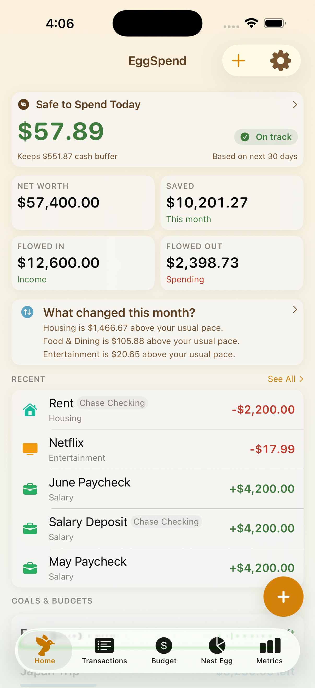
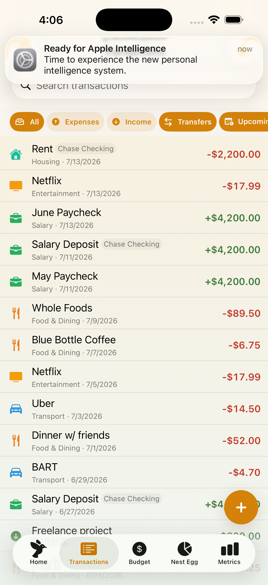
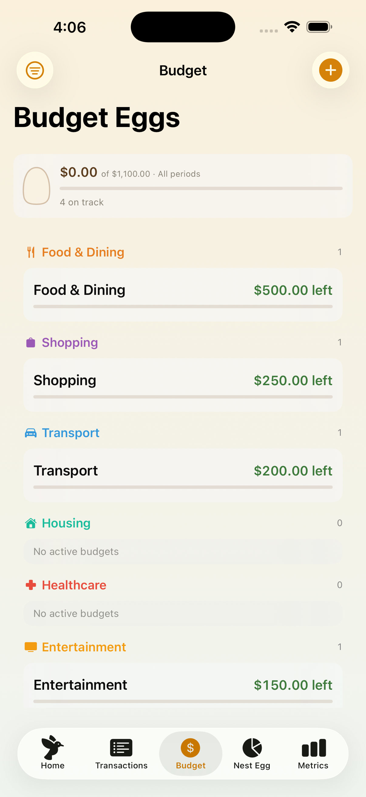
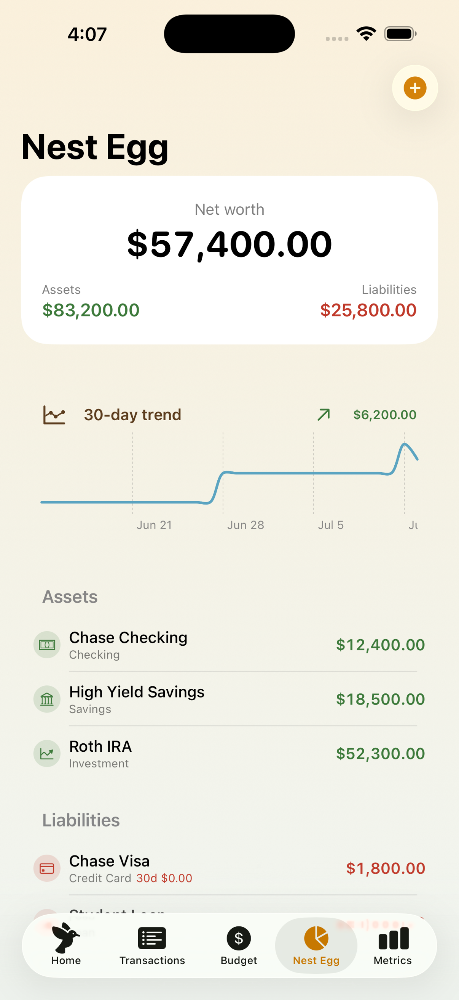
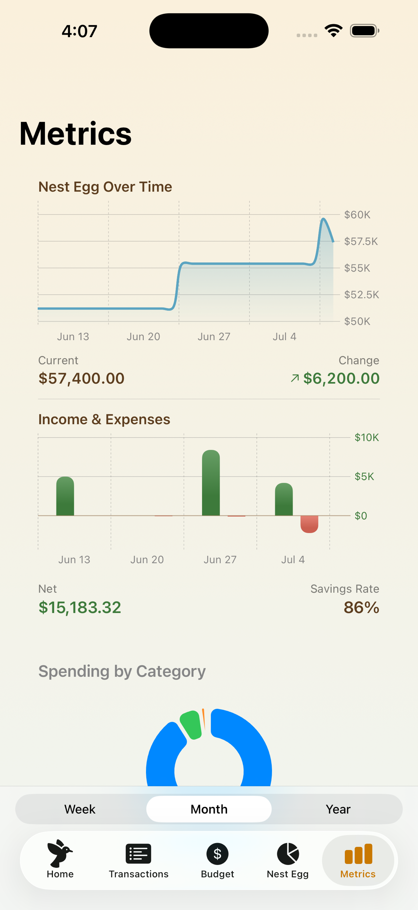

# EggSpend

A SwiftUI personal finance app for tracking transactions, budgets, accounts, and net worth.

<p align="center">
  
  
  
  
  
</p>

## Features

- Transaction tracking with CSV import (account linking, duplicate detection)
- Accounts with balance edits as explicit adjustment transactions
- Budgets with category-based tracking
- Recurring transactions with subscription detection and audit screen
- Cash-flow forecasts (30/60/90-day projections)
- Spending metrics and monthly review with "what changed this month" insights
- Optional on-device AI narratives (when Apple Intelligence available)
- Net worth / nest egg tracking with daily balance snapshots
- Savings goals and debt payoff calculator
- Data export (CSV and full JSON backup)
- Auto-categorization from manual patterns
- Face ID/Touch ID app lock with passcode fallback
- First-run onboarding (skippable)
- Locale-aware currency display
- VoiceOver support across charts and controls
- Redesigned five-tab interface with compact ledger rows, Quick Add, and unified Nest Egg tracking

## Stack

- Swift 6, SwiftUI, SwiftData
- CloudKit-backed `ModelContainer` with automatic local fallback (no iCloud sign-in required)
- iOS 26.0+
- Xcode 26.6, iPhone 17 simulator workflow

## Getting Started

```bash
open EggSpend.xcodeproj
```

Or build and test from the command line:

```bash
# Build
xcodebuild build -project EggSpend.xcodeproj -scheme EggSpend -destination 'platform=iOS Simulator,name=iPhone 17'

# Run all tests
xcodebuild test -project EggSpend.xcodeproj -scheme EggSpend -destination 'platform=iOS Simulator,name=iPhone 17'
```

Useful launch arguments (set in the Xcode scheme or via `ProcessInfo`):

- `--preview-data` — seeds sample transactions, accounts, and budgets on launch; also skips onboarding
- `--tab <index>` — opens a specific root tab: `0` Home, `1` Transactions, `2` Budget, `3` Nest Egg, `4` Metrics

## Repository Structure

- `EggSpend/` — app source
  - `Models/` — Nine SwiftData models: `Transaction`, `TransactionCategory`, `Account`, `Budget`, `RecurringTransaction`, `SavingsGoal`, `Transfer`, `BalanceSnapshot`, `CategoryRule`
  - `Views/` — SwiftUI feature screens (Accounts, Budget, Categories, Components, Dashboard, Forecast, Import, Metrics, NetWorth, Onboarding, Recurring, SafeSpend, SavingsGoals, Settings, Subscriptions, Transactions)
  - `Persistence/` — `ModelContainer` setup and default data seeding
  - `Utilities/` — business logic (`CSVParser`, `AccountBalanceService`, `MonthlyReviewCalculator`, `NetWorthCalculator`, `SafeSpendCalculator`, `RecurringProjection`, `TransactionFilter`, `AmountParser`, `DebtPayoffCalculator`, `CurrencyFormat`, `DataExporter`, `BalanceSnapshotService`, `SubscriptionDetector`, `CategoryRuleEngine`, `SpendingDeltaCalculator`, `NarrativeGenerator`, `AppLockController`, `TransactionGrouping`, `DuplicateSweeper`)
  - `EggSpendTheme.swift` — shared colors, gradients, and view modifiers
- `EggSpendTests/` — 469 XCTest cases covering models, metrics, budgets, forecasting, persistence, and more
- `generate_project.py` — generates `EggSpend.xcodeproj/project.pbxproj` and registers resources; keep in sync when adding/removing Swift files
- `docs/` — GitHub Pages site (privacy policy, support page)
- `screenshots/` — App Store screenshot sets

## Redesign Notes

The current UI uses the shared `EggSpendTheme` design tokens and a single `LedgerRowView` for transactions, transfers, and upcoming recurring rows. The old standalone `AccountsView.swift` screen was retired during the redesign; account management now lives in the Nest Egg flow and related settings/manage screens.

## Contributing

See [CLAUDE.md](CLAUDE.md) for architecture notes and development conventions.

## Support

Questions, bug reports, or feedback: [ryan@gnwn.dev](mailto:ryan@gnwn.dev). See also the [support page](docs/support.md) and [privacy policy](docs/app-store-privacy.md).
